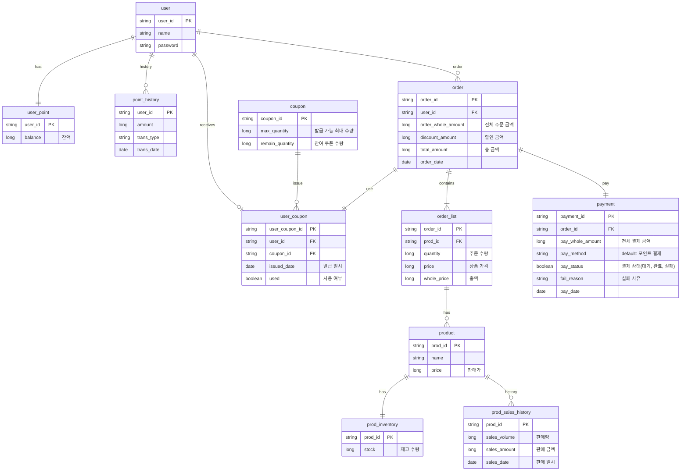
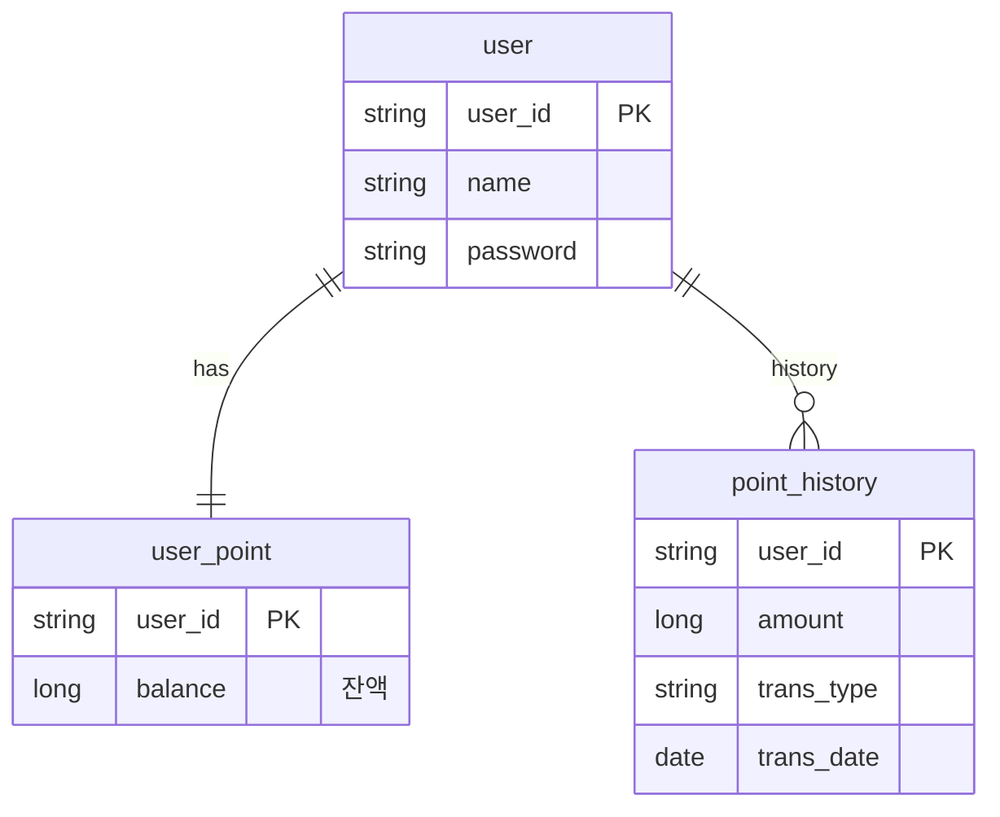
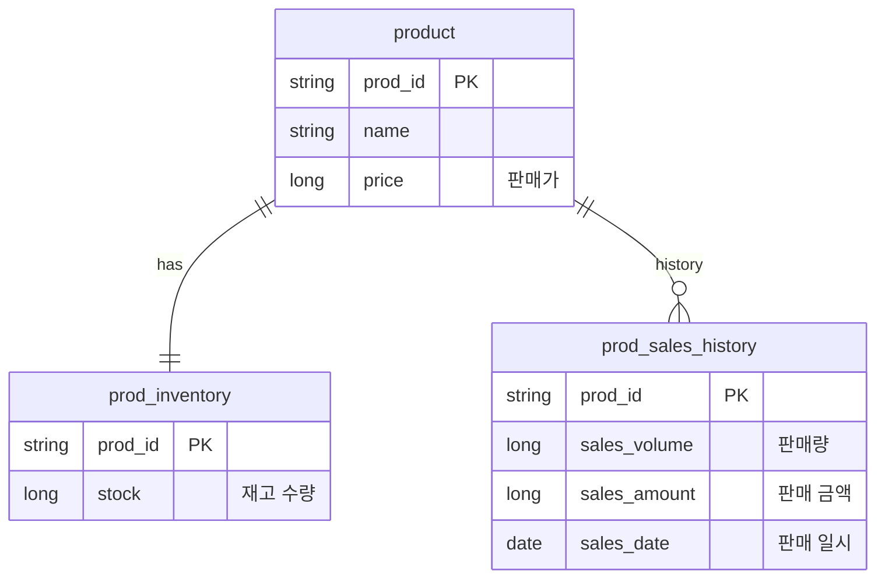
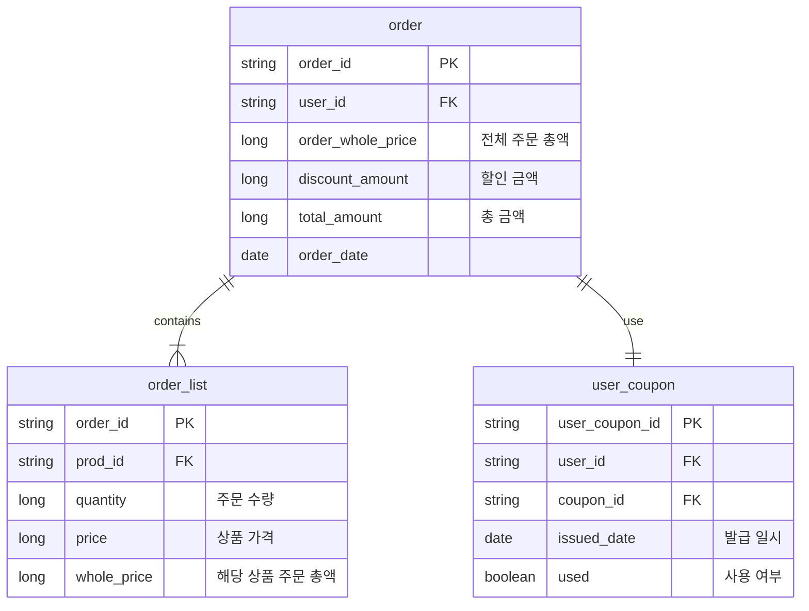
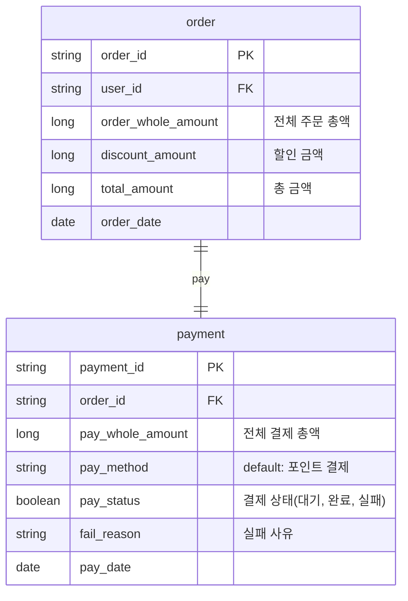
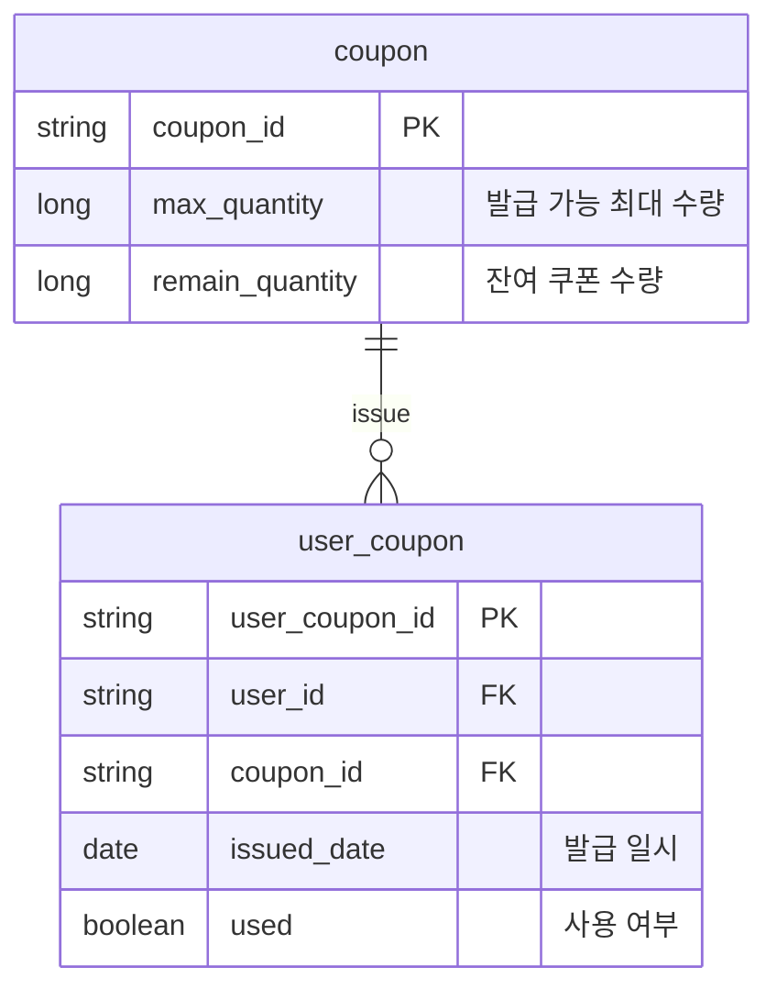

## 전체 테이블

```mermaid
erDiagram
    user {
        string user_id PK
        string name
        string password
    } 
    user_point {
        string user_id PK
        long balance "잔액"
    }
    point_history {
        string user_id PK 
        long amount 
        string trans_type 
        date trans_date 
    }
    product {
        string prod_id PK
        string name 
        long price "판매가"
    }
    prod_inventory {
        string prod_id PK
        long stock "재고 수량"
    }
    prod_sales_history {
        string prod_id PK
        long sales_volume "판매량"
        long sales_amount "판매 금액"
        date sales_date "판매 일시"
    }
    coupon {
        string coupon_id PK
        long max_quantity "발급 가능 최대 수량"
        long remain_quantity "잔여 쿠폰 수량"
    }
    user_coupon {
        string user_coupon_id PK
        string user_id FK 
        string coupon_id FK
        date issued_date "발급 일시"
        boolean used "사용 여부"
    }
    order {
        string order_id PK
        string user_id FK
        long order_whole_amount "전체 주문 금액"
        long discount_amount "할인 금액"
        long total_amount "총 금액"
        date order_date
    }
    order_list {
        string order_id PK
        string prod_id FK
        long quantity "주문 수량"
        long price "상품 가격"
        long whole_price "총액"
    }
    payment { 
        string payment_id PK
        string order_id FK
        long pay_whole_amount "전체 결제 금액"
        string pay_method "default: 포인트 결제"
        boolean pay_status "결제 상태(대기, 완료, 실패)"
        string fail_reason "실패 사유"
        date pay_date
    }
    user ||--||user_point : has
    user ||--o{point_history : history
    user ||--o{order : order
    order ||--|{order_list : contains
    order ||--||payment : pay
    order_list ||--o{product : has
    product ||--||prod_inventory : has
    product ||--o{prod_sales_history : history
    user||--o|user_coupon : receives 
    coupon ||--o{user_coupon : issue
    order ||--||user_coupon : use
```

## 유저 테이블 

```mermaid
erDiagram
    user {
        string user_id PK
        string name
        string password
    } 
    user_point {
        string user_id PK
        long balance "잔액"
    }
    point_history {
        string user_id PK 
        long amount 
        string trans_type 
        date trans_date 
    }
    user ||--||user_point : has
    user ||--o{point_history : history
```

## 상품 테이블

```mermaid
erDiagram
    product {
        string prod_id PK
        string name 
        long price "판매가"
    }
    prod_inventory {
        string prod_id PK
        long stock "재고 수량"
    }
    prod_sales_history {
        string prod_id PK
        long sales_volume "판매량"
        long sales_amount "판매 금액"
        date sales_date "판매 일시"
    }
    product ||--||prod_inventory : has
    product ||--o{prod_sales_history : history
```

## 주문 테이블

```mermaid
erDiagram
    order {
        string order_id PK
        string user_id FK
        long order_whole_price "전체 주문 총액"
        long discount_amount "할인 금액"
        long total_amount "총 금액"
        date order_date
    }
    order_list {
        string order_id PK
        string prod_id FK
        long quantity "주문 수량"
        long price "상품 가격"
        long whole_price "해당 상품 주문 총액"
    }
    user_coupon {
        string user_coupon_id PK
        string user_id FK 
        string coupon_id FK
        date issued_date "발급 일시"
        boolean used "사용 여부"
    }
    order ||--|{order_list : contains
    order ||--||user_coupon : use
```

## 결제 테이블

```mermaid
erDiagram
    order {
        string order_id PK
        string user_id FK
        long order_whole_amount "전체 주문 총액"
        long discount_amount "할인 금액"
        long total_amount "총 금액"
        date order_date
    }
    payment { 
        string payment_id PK
        string order_id FK
        long pay_whole_amount "전체 결제 총액"
        string pay_method "default: 포인트 결제"
        boolean pay_status "결제 상태(대기, 완료, 실패)"
        string fail_reason "실패 사유"
        date pay_date
    }
    order ||--||payment : pay
```

## 쿠폰 테이블

```mermaid
erDiagram
    coupon {
        string coupon_id PK
        long max_quantity "발급 가능 최대 수량"
        long remain_quantity "잔여 쿠폰 수량"
    }
    user_coupon {
        string user_coupon_id PK
        string user_id FK 
        string coupon_id FK
        date issued_date "발급 일시"
        boolean used "사용 여부"
    }
    coupon ||--o{user_coupon : issue
```
