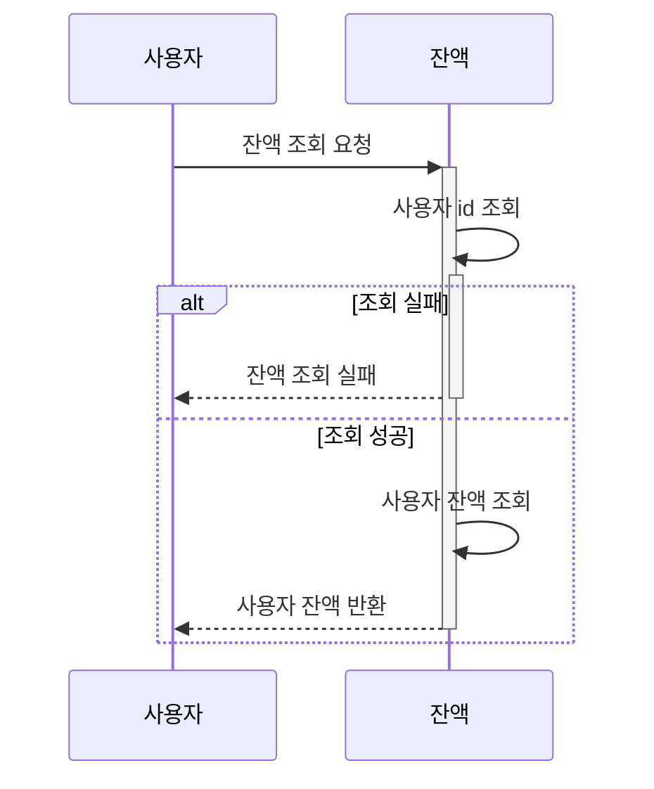
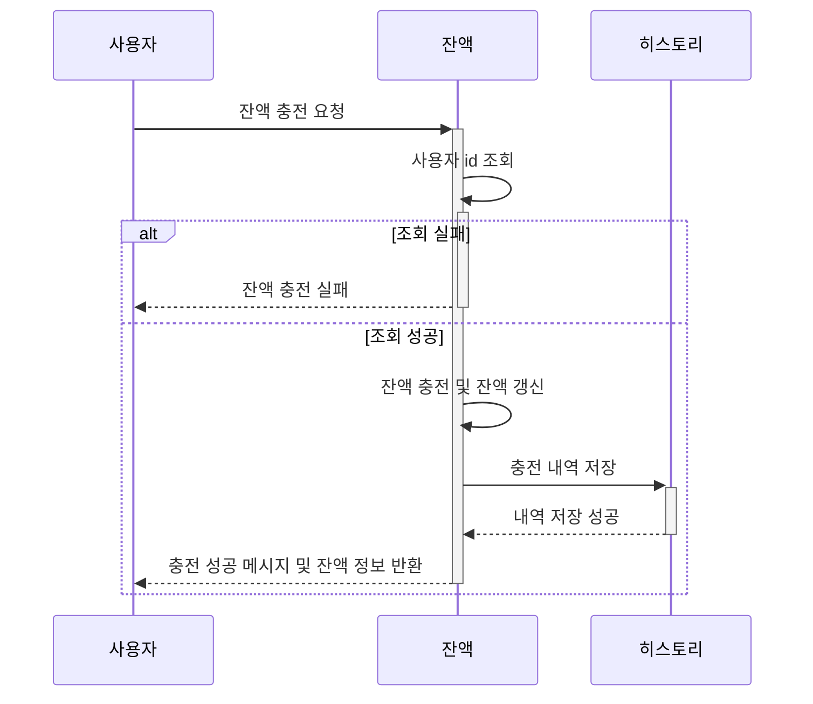
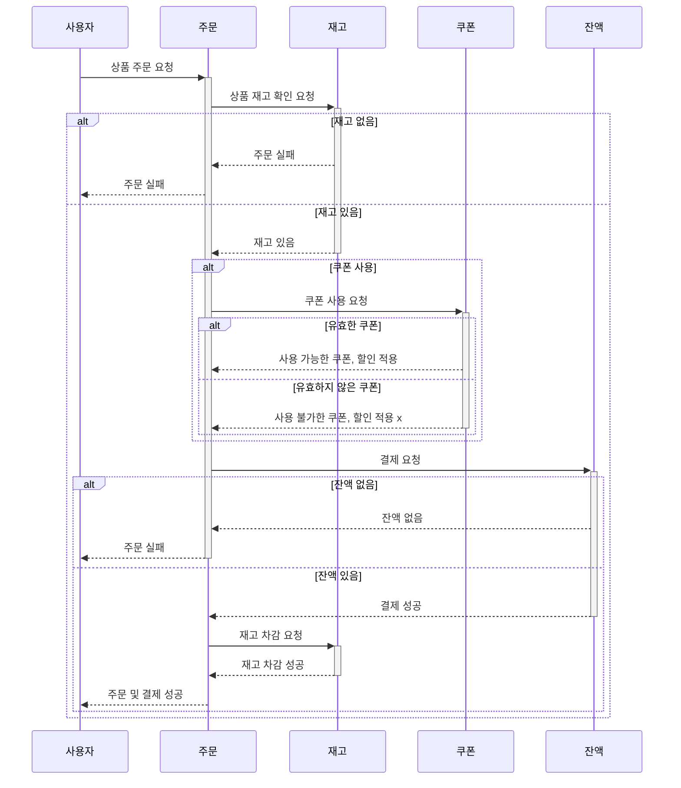
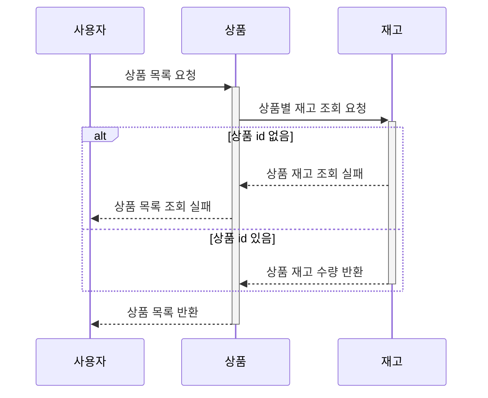
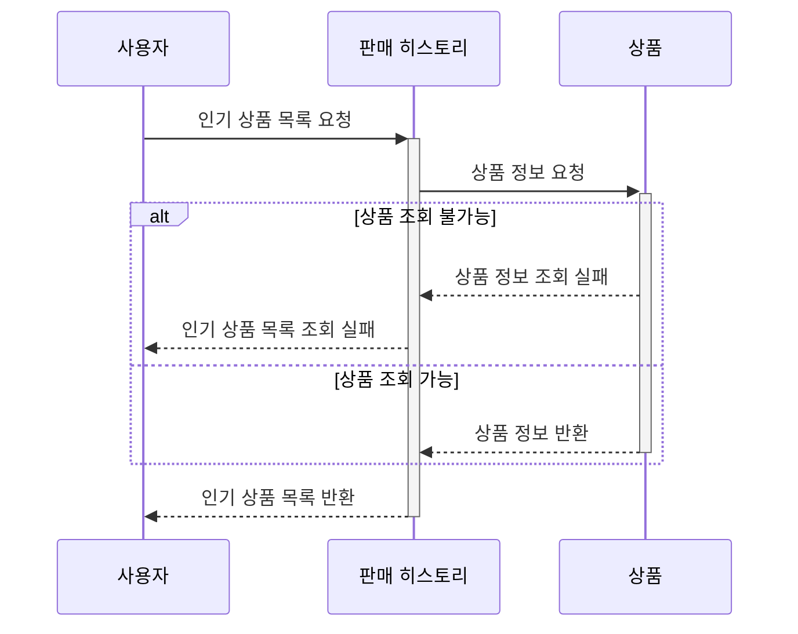

## 잔액 조회

잔액 조회 seq

   
  

```mermaid
sequenceDiagram
    사용자->>+잔액: 잔액 조회 요청
    잔액->>+잔액: 사용자 id 조회
    alt 조회 실패
        잔액-->>-사용자: 잔액 조회 실패
    else 조회 성공 
        잔액->>잔액: 사용자 잔액 조회
        잔액-->>-사용자: 사용자 잔액 반환
    end
```

 

## 잔액 충전

잔액 충전 seq

   
  

```mermaid
sequenceDiagram
    사용자->>+잔액: 잔액 충전 요청
    잔액->>+잔액: 사용자 id 조회
    alt 조회 실패
        잔액-->>-사용자: 잔액 충전 실패
    else 조회 성공 
        잔액->>잔액: 잔액 충전 및 잔액 갱신
        잔액->>+히스토리: 충전 내역 저장
        히스토리-->>-잔액: 내역 저장 성공
        잔액-->>-사용자: 충전 성공 메시지 및 잔액 정보 반환
    end
```

 

## 주문 및 결제

주문 및 결제 seq

   
  

```mermaid
sequenceDiagram
    사용자->>+주문: 상품 주문 요청
    주문->>+재고: 상품 재고 확인 요청
    
    alt 재고 없음
        재고-->>주문: 주문 실패
        주문-->>사용자: 주문 실패
    else 재고 있음 
        재고-->>-주문: 재고 있음
        alt 쿠폰 사용
            주문->>+쿠폰: 쿠폰 사용 요청
            alt 유효한 쿠폰
                쿠폰-->>주문: 사용 가능한 쿠폰, 할인 적용
            else 유효하지 않은 쿠폰
                쿠폰-->>-주문: 사용 불가한 쿠폰, 할인 적용 x
            end
        end
        주문->>+잔액: 결제 요청
        alt 잔액 없음
            잔액-->>주문: 잔액 없음
            주문-->>-사용자: 주문 실패
        else 잔액 있음
            잔액-->>-주문: 결제 성공
            주문->>+재고: 재고 차감 요청
            재고-->>-주문: 재고 차감 성공
            주문-->>사용자: 주문 및 결제 성공
        end
    end
```

 

## 상품 조회

상품 조회 seq

   
  

```mermaid
sequenceDiagram
    사용자->>+상품: 상품 목록 요청
    상품->>+재고: 상품별 재고 조회 요청
    alt 상품 id 없음
        재고-->>상품: 상품 재고 조회 실패
        상품-->>사용자: 상품 목록 조회 실패
    else 상품 id 있음
        재고-->>-상품: 상품 재고 수량 반환
    end
    상품-->>-사용자: 상품 목록 반환
```

 

## 인기 상품 조회

인기 상품 조회 seq

   
  

```mermaid
sequenceDiagram
    사용자->>+판매 히스토리: 인기 상품 목록 요청
    판매 히스토리->>+상품: 상품 정보 요청
    alt 상품 조회 불가능
        상품-->>판매 히스토리: 상품 정보 조회 실패
        판매 히스토리-->>사용자: 인기 상품 목록 조회 실패
    else 상품 조회 가능
        상품-->>-판매 히스토리: 상품 정보 반환
    end
    판매 히스토리-->>-사용자: 인기 상품 목록 반환
```

 
